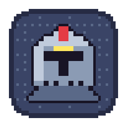

<p align="center"></p>

# Herdr Pixel Dungeon

**A native pixel-art guild for your live Herdr agents, for macOS and Linux.**

Written in **Rust** on `egui`/`eframe`, with a status item in the menu bar or system tray. Each agent is an animated hero in a dungeon room that changes with its real Herdr status. Lives in a small floating window. No browser, WebView, Node.js, account or server required.

<p align="center">
  
</p>

<p align="center"><a href="docs/media/demo.mp4">Watch the full demo video</a> · <a href="docs/media/widget.png">Full-size screenshot</a></p>

## Download

Prebuilt binaries for macOS (`.app`, zipped) and Linux (x86_64 tarball with a `.desktop` entry and icon) are on the [Releases](https://github.com/JoseValencia125/herdr-pixel-dungeon/releases) page. The macOS app is ad-hoc signed, not notarized: the first time, right-click it and choose Open.

## Build and open

Requires [Rust](https://rustup.rs) (stable) and [Herdr](https://herdr.dev) with `herdr api snapshot` support. Tested with Herdr 0.9.1.

```sh
git clone https://github.com/JoseValencia125/herdr-pixel-dungeon.git
cd herdr-pixel-dungeon
./scripts/build.sh
```

On **macOS** that produces `build/Herdr Pixel Dungeon.app` (a locally ad-hoc-signed bundle, so the app is menu-bar only with no Dock icon; it is not Developer ID signed or notarized):

```sh
open 'build/Herdr Pixel Dungeon.app'
# optional installation
mkdir -p ~/Applications && ditto 'build/Herdr Pixel Dungeon.app' "$HOME/Applications/Herdr Pixel Dungeon.app"
```

On **Linux** (X11 or Wayland) it produces `build/herdr-pixel-dungeon`. The tray icon, dialogs and sounds need GTK 3, an AppIndicator-capable tray (libayatana-appindicator), xdo and ALSA; on Debian/Ubuntu:

```sh
sudo apt install libgtk-3-dev libayatana-appindicator3-dev libxdo-dev libasound2-dev
./scripts/build.sh
./build/herdr-pixel-dungeon
# optional: a launcher entry and icon
cp build/herdr-pixel-dungeon ~/.local/bin/ && cp build/herdr-pixel-dungeon.desktop ~/.local/share/applications/ && cp build/herdr-pixel-dungeon.png ~/.local/share/icons/
```

`cargo test` and `herdr-pixel-dungeon --self-test` run the same checks (everything that works without a window). `--demo` shows fictional agents without Herdr; `--diagnose` prints what Herdr reports. `HPD_NO_HERDR=1` pretends Herdr is not installed, to try the standalone viewer. `HPD_LANG=en` forces a language (Spanish, English, French, Italian and Portuguese follow the system locale otherwise), and `HPD_REDUCE_MOTION=1` stops the animations.

Close the window to keep monitoring from the menu bar, where a pixel knight's helm marks the app. Use its menu to reopen the window, set sounds and notifications, or quit. **Herdr session** lists Herdr's sessions (`herdr session list`) to switch which one the dungeon watches — agents, log and selection start over — and remembers your pick; `HERDR_SESSION` still overrides it at launch. The same menu has **Demo** to try fictional agents without Herdr, **Always on top** (on by default) and **Open at login** (a LaunchAgent on macOS, an autostart entry on Linux). The widget reopens where you left it, at the size you gave it, and remembers sounds, notifications, the session and the state filter. Live mode never inserts fictional agents.

## States and rooms

| Herdr state | | Room | Hero |
| --- | --- | --- | --- |
| `working` |  | Forge: lit furnace, anvil and sparks | Attacking |
| `blocked` |  | Sealed door: chains, keyhole seal, empty pedestal | Jumps on the rug under a red "!" |
| `idle` |  | Inn room: bed, fireplace, moonlit window, sleeping cat | Waiting |
| `done` |  | Treasure chamber: golden light, gem, open chest | Completion marker |
| unknown |  | Foggy crossroads: three doors, broken signpost | Unknown |

All five rooms are one shared dungeon room that changes with the state. The source is `art/dungeon_rooms.aseprite`, with one tagged frame per state.

<p align="center"></p>

Each harness has its own classic hero, coloured after the tool's brand (no logos are reproduced): **claude** is a coral wizard, **codex** a monochrome knight, **kiro** a purple-hooded rogue with a ghost face, **gemini** a blue star cleric, and any other harness a green adventurer. Source: `art/heroes.aseprite`.

**What a working agent does.** For Claude Code agents the hero goes to the station that matches the last tool the agent called: it reads a book for `Read`, `Grep`, `Glob`, `WebSearch` and `WebFetch`, forges at the anvil for `Edit` and `Write`, brews potions for `Bash`, summons in a magic circle for `Task` (subagents), studies a scroll for todo lists and plans, and types at the laptop while thinking or writing. Codex and Kiro agents do the same from their own session logs, matched by the session ID Herdr reports: Codex's rollout (`~/.codex/sessions/…/rollout-…-<id>.jsonl`; a shell command that only looks at files counts as reading, `apply_patch` as forging, `update_plan` as planning) and Kiro's session (`~/.kiro/sessions/cli/<id>.jsonl`). Only tool names and commands' first word are read. Harnesses whose activity cannot be read (Gemini and the rest) make the rounds of every station rather than pretend to know.

**Background sessions.** When a Claude Code pane shows its list of background sessions, Herdr reports the pane as idle, or reflects only the highlighted session, even while other sessions keep working. The app also reads each job's `~/.claude/jobs/<id>/state.json` (state and folder only) and gives a Claude Code pane the most urgent state among the sessions started in its folder during the last hour: one waiting for input makes the room *blocked*, one working makes it *working*. Only jobs whose process is still alive count (Claude Code keeps a terminal socket per running job under `/tmp/cc-daemon-<uid>/`), so a job that died while asking something does not keep its room asking for attention.

<p align="center"></p>

**Chat and sounds.** Click a room to open a chat panel for that agent: it shows the last lines of its terminal, sends a message (or the answer to a question it is asking), and has buttons to accept or decline a permission prompt, interrupt the agent, or focus its pane in Herdr. While the agent is asking something with numbered options, ↑ and ↓ (or a click) highlight an option in the panel and put its text in the box; ⏎ then picks it, moving the agent's own menu to that option, or sends the text when the question is plain text. With nothing typed, ⏎ picks the option its terminal already highlights. Right-click a room and choose **End agent** to type `/exit` into its chat after a confirmation (Return cancels; ending needs a click). A working or asking agent gets esc first. A soft two-note chime plays when an agent needs help and a gentle rising one when it finishes (bell-like tones synthesized in the app). Turn either off, mute everything, or hear them with **Play the sounds**, from the widget or the menu bar.

**Summon agents.** The **+** button (top-right on hover) opens a panel under the rooms: pick a harness (claude, codex, gemini, kiro, opencode, cursor, copilot, amp), a folder — one your agents already work in, or any other — and an optional first prompt, then **Summon** (⌘⏎). Herdr creates a workspace in that folder (`herdr workspace create`), starts the agent in its shell (`herdr agent start`) and sends the prompt (`herdr agent prompt`); the new hero walks into the dungeon with the next update. The harness and folder are remembered.

**Activity log.** The scroll button (top-right on hover, and in the bar under the rooms) unrolls the guild's log on a parchment: agents joining and leaving, state changes (needing attention, finishing…), subagents starting and the messages you sent, newest first with the time. It keeps the last 40 lines in memory only.

**Notifications.** When an agent starts needing help the app also posts a desktop notification (Notification Center on macOS, the notification daemon on Linux) with the question when it knows it; a finished agent can notify too. On Linux, clicking the banner brings up the dungeon with that agent's chat open. Turn them on or off per moment from the status item's **Notifications** menu.

**Text size.** ⌘+ / ⌘- (Ctrl on Linux) make the panels' text bigger or smaller, ⌘0 resets it; the menu's **Text size** does the same. The size is remembered.

**Many agents.** Resize the widget from its edges or the grip in its bottom-right corner: rooms wrap like a flex row into as many columns as fit, and the window snaps to whole rooms. It starts at two columns and up to four rows; the size you pick is remembered, the smallest is one room. With fewer agents than columns it narrows (a single agent is one square), and it grows with the agents up to your row count; past that, scroll with the trackpad or wheel and a thin bar shows where you are. Opening an agent's chat scrolls its room into view. With three or more agents a bar under the rooms shows one chip per state with its count — click one to show only those rooms (the red **!** chip stays lit while anyone needs you) — and a search box that matches project, harness, branch, folder and activity, ignoring case and accents. The chosen chip is remembered.

**Subagents.** Herdr does not report subagents, so for Claude Code agents the app reads the transcripts Claude Code writes under `~/.claude/projects/<project>/<session>/subagents/`. It matches them by the session ID in Herdr's snapshot. A subagent counts as active while its transcript changed in the last 30 seconds. Active subagents appear as small heroes of the same harness, with a count in the room's title. Each one goes to the station of the last tool in its own transcript (reading at the shelf, brewing at the alchemy table, forging at the anvil, typing beside the lead hero…) and walks to a new one when it changes tool. Other harnesses show no subagents.

- Event-driven: the app keeps one connection to Herdr's socket subscribed to its events (`events.subscribe`: each agent pane's status, panes appearing, changing or closing, workspaces renamed or closed), so a change shows up the moment it happens. `herdr api snapshot` runs only to bootstrap, after a structural change, once a minute to reconcile, and — if the event connection drops — every second as before while it reconnects. Local enrichment (branch, jobs, subagents, tools) is read from files each second without starting processes.
- Native egui animations and crisp nearest-neighbor sprites: the hero types, hammers, jumps on the rug when it needs you, celebrates or sleeps depending on the room.
- Search, state filters, agent selection, project, pane, directory and terminal title.
- Latest status change and per-state counts; the menu bar shows only the helm icon, with the number of agents needing attention in its tooltip.
- Explicit connection state: when Herdr is unreachable or its data stops updating, a banner over the rooms says so with the time since the last good update, and the last known rooms stay on screen, faded, while the app keeps reconnecting.
- Animation pause with macOS Reduce Motion (or `HPD_REDUCE_MOTION=1`).
- Artist credits and licenses accessible from the app.

Activity means **the title reported by the terminal**, not an inferred summary. Animation represents state, not tool calls or completion percentage. Agents outside the selected Herdr session are not included. Very large rosters may share visual positions; the list remains complete.

## Languages

The interface is available in Spanish, English, French, Italian and Portuguese. It follows the macOS language, including the per-app setting in System Settings › General › Language & Region. Other languages fall back to English. Translations live in `Sources/L10n.swift`.

## Configuration

Monitors the principal local session by default. For a named session/custom executable, launch directly:

```sh
HERDR_SESSION=my-session HERDR_BIN=/absolute/path/to/herdr 'build/Herdr Pixel Dungeon.app/Contents/MacOS/HerdrPixelDungeon'
```

Herdr discovery: `~/.local/bin`, `/opt/homebrew/bin`, `/usr/local/bin`, then inherited `PATH`. GUI launches may have a different PATH from your shell. One session per app instance.

## Privacy

The app polls `herdr api snapshot`. It only acts on a terminal when you use the chat panel: then it reads the agent's recent output (`herdr agent read`) and sends exactly what you typed or clicked (`herdr agent prompt`, `send-keys`, `pane send-text`, `agent focus`). No network listener, telemetry or credential access. It reads the state and folder of Claude Code background jobs from `~/.claude/jobs/*/state.json`, and two things from Claude Code's local transcripts: the modification times of subagent transcripts (see Subagents) and, from the last 128 KB of a working session's transcript, the message type and the name of the last tool called. Tool inputs and outputs are never used. When a background job is asking you something, its chat panel shows that question, read from the end of its last message (from the line that asks it on); this text is only displayed, never stored or sent anywhere. Agent data remains in memory. External links open only when clicked. Public source and demo data contain no live user sessions.

## Verify

```sh
./scripts/build.sh
'build/Herdr Pixel Dungeon.app/Contents/MacOS/HerdrPixelDungeon' --self-test
'build/Herdr Pixel Dungeon.app/Contents/MacOS/HerdrPixelDungeon' --diagnose
open 'build/Herdr Pixel Dungeon.app' --args --demo
```

Self-tests cover snapshot states, invalid/empty replies, monitor transitions, subagents, tool actions, translations, sound alerts and their settings, chat selection, git branches, hero mapping and bundled PNG decoding. `--diagnose` prints live agent data; review it before sharing publicly.

## Support

If the dungeon is useful to you, you can [sponsor the project on GitHub](https://github.com/sponsors/JoseValencia125). Sponsorships help pay for the time spent drawing new heroes and rooms and keeping up with Herdr releases.

## Credits and licenses

- **Nacho Valencia**: code, room backgrounds (`Resources/Sprites/rooms`) and heroes (`Resources/Sprites/heroes`), sources in `art/`. MIT, see [LICENSE](LICENSE) and [NOTICE.md](NOTICE.md).
- **Inspiration**: [Claude Dungeon](https://github.com/thousandsky2024/claude-pixel-agent-web) by thousandsky2024. No code or art from it is included.
- **Herdr contributors**: [Herdr](https://github.com/herdrdev/herdr) and its local API. Herdr is installed separately.

Independent project; no endorsement or affiliation implied.

## Without Herdr (optional)

Herdr is what lets the dungeon talk to the agents: it owns their terminals, reports each pane's state and types into it. Without it the app still works as a **read-only viewer**: it finds the agents running in any terminal by their processes (Claude Code, Codex, Kiro, Gemini and the other harnesses Herdr knows) and infers their state from the files they write — Claude Code and Codex transcripts give working, waiting, and a tool call waiting for permission; the last prompt becomes the room's activity line. The chat shows the agent's last reply but cannot send anything, and there is no summoning. A banner over the rooms offers **Install Herdr** (its official installer, `curl -fsSL https://herdr.dev/install.sh | sh`), **Open Herdr** (a terminal running `herdr`, which leaves its server up) or **Carry on without Herdr**; the menu's **Open Herdr at startup** does the opening for you. Agents only appear in the full dungeon when they run inside Herdr.

## Credits

Created by **Nacho Valencia**. All pixel art is original, drawn in Aseprite for this project.

Inspired by **[Claude Dungeon](https://github.com/thousandsky2024/claude-pixel-agent-web)** by [thousandsky2024](https://github.com/thousandsky2024), which first pictured coding agents as dungeon heroes. No code or artwork from it is included; see NOTICE.md.
