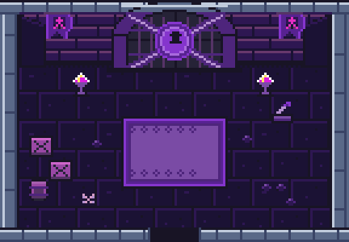
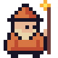
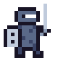
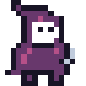
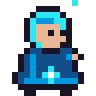
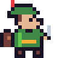

<p align="center"></p>

# Herdr Pixel Dungeon

**A native pixel-art guild for your live [Herdr](https://herdr.dev) agents, for macOS and Linux.**

Each coding agent is a hero in a dungeon room that changes with its real Herdr status: working at the forge, asking for your attention, caged until its usage limit resets, resting, done. Click a room to answer the agent, accept or decline its permission prompts, or summon a new one. Rust, `egui`, a status item in the menu bar or tray, no browser or server.

<p align="center">
  
</p>

<p align="center"><a href="docs/media/demo.mp4">Watch the full demo video</a> · <a href="docs/media/widget.png">Full-size screenshot</a> · <a href="docs/GUIDE.md">Guide</a></p>

## Download

Binaries for macOS (`.app`) and Linux (x86_64) are on the [Releases](https://github.com/JoseValencia125/herdr-pixel-dungeon/releases) page. The macOS app is ad-hoc signed, not notarized: the first time, right-click it and choose Open.

## States and rooms

| Herdr state | | Room | Hero |
| --- | --- | --- | --- |
| `working` |  | Workshop: desk, bookshelves, forge, alchemy table | Works at the station of its last tool: reads, forges, brews, summons, plans or types |
| `blocked` |  | Sealed door, braziers, a rug | Jumps on the rug under a pulsing red "!" |
| session limit |  | The sealed room in violet | Locked in a cage that drops from the ceiling, rattling the bars over a countdown to the reset |
| `idle` |  | Inn room at night | Sleeps under the blanket, z's drifting up |
| `done` |  | Treasure chamber | Jumps for joy under a green tick, confetti flying |
| unknown |  | Ruins with a portal | Wanders, looking around |

When the state changes the hero walks out through the door, the room changes behind it, and it walks back in.

The session limit is not a Herdr state: the dungeon reads it from Claude Code's own files when an agent or one of its background sessions hits its usage limit ("You've hit your session limit · resets 2:20pm"), and shows it until the limit resets.

## Heroes

| Harness | Hero | |
| --- | :---: | --- |
| **claude** (Claude Code) |  | Coral wizard with a staff |
| **codex** (OpenAI Codex) |  | Monochrome knight with sword and shield |
| **kiro** (Amazon Kiro) |  | Purple-hooded rogue with a ghost face |
| **gemini** (Google Gemini CLI) |  | Blue star cleric |
| any other |  | Green adventurer |

Original pixel art drawn in Aseprite (sources in `art/`), coloured after each tool's brand; no logos are reproduced.

## What it does

- **Chat with an agent**: its terminal's last lines, a box to reply, ↑/↓ to pick among a question's options, Accept / Decline / Stop buttons, `/exit` from the right-click menu.
- **Summon agents** in any folder with a first prompt, through Herdr.
- **Session limits**: a trapped agent waits in a cage with the time left until its limit resets, also shown in its chat.
- **Chimes and desktop notifications** when an agent needs help or finishes.
- **Subagents** as small heroes at the station of their own tool (Claude Code).
- **Filters, search and an activity log**; the window resizes to whole rooms, scrolls, and remembers where you left it.
- **Full screen** (⌃⌘F, F11 on Linux): its own space, one column of rooms on the left, the live console (colours and all) in the rest.
- **Event-driven**: Herdr's socket events the moment they happen, snapshots only to reconcile.
- Spanish, English, French, Italian and Portuguese.

The [guide](docs/GUIDE.md) has the details: how states are read, background jobs, the menu, configuration, privacy and the optional viewer mode without Herdr.

## Build and open

Requires [Rust](https://rustup.rs) (stable) and [Herdr](https://herdr.dev). Tested with Herdr 0.9.x.

```sh
git clone https://github.com/JoseValencia125/herdr-pixel-dungeon.git
cd herdr-pixel-dungeon
./scripts/build.sh
```

- **macOS**: `open 'build/Herdr Pixel Dungeon.app'` (optionally copy it to `~/Applications`).
- **Linux** (X11 or Wayland): `./build/herdr-pixel-dungeon`. Needs GTK 3, libayatana-appindicator, xdo and ALSA — on Debian/Ubuntu `sudo apt install libgtk-3-dev libayatana-appindicator3-dev libxdo-dev libasound2-dev`. `build/` also has a `.desktop` entry and icon.

`cargo test` and `--self-test` run the checks; `--demo` shows fictional agents without Herdr.

## Support the Guild 🧪⚔️

Herdr Pixel Dungeon is free and open source, built alongside other experiments in AI agents, developer tooling and pixel-art interfaces. If it brightens your terminal, you can buy the guild a potion on [GitHub Sponsors](https://github.com/sponsors/JoseValencia125).

<p align="center"><a href="https://github.com/sponsors/JoseValencia125"></a></p>

| Potion | Price | |
| --- | --- | --- |
| 🧪 [**Small Potion**](https://github.com/sponsors/JoseValencia125/sponsorships?tier_id=665811) | $3, one-time | A small thank-you that keeps the project alive and the agents adventuring. |
| 🧪✨ [**Greater Potion**](https://github.com/sponsors/JoseValencia125/sponsorships?tier_id=665812) | $10, one-time | For those who really enjoy the project and want to give development an extra boost. |

Prefer another amount? Pick a [custom one-time or monthly sponsorship](https://github.com/sponsors/JoseValencia125). Every potion goes into new heroes and rooms, bug fixes and keeping up with Herdr releases. No paywalls: every feature stays free for everyone.

Thank you for supporting independent open-source development. ⚔️

## Credits and licenses

Created by **Nacho Valencia**: code and all pixel art. MIT, see [LICENSE](LICENSE) and [NOTICE.md](NOTICE.md).

Inspired by **[Claude Dungeon](https://github.com/thousandsky2024/claude-pixel-agent-web)** by [thousandsky2024](https://github.com/thousandsky2024), which first pictured coding agents as dungeon heroes. No code or artwork from it is included.

[Herdr](https://github.com/herdrdev/herdr) is by the Herdr contributors and is installed separately. Independent project; no endorsement or affiliation implied.
