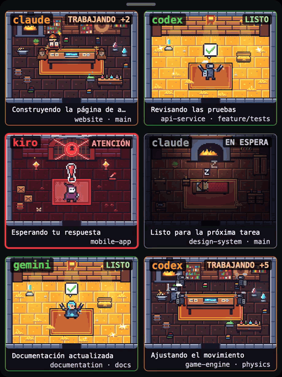
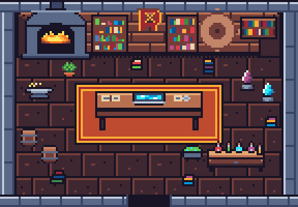
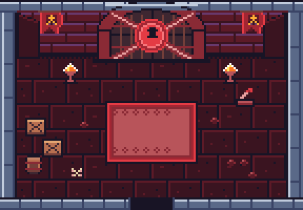
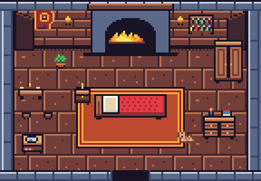
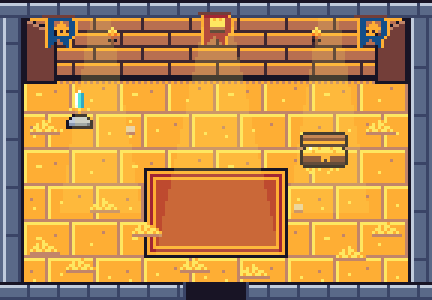
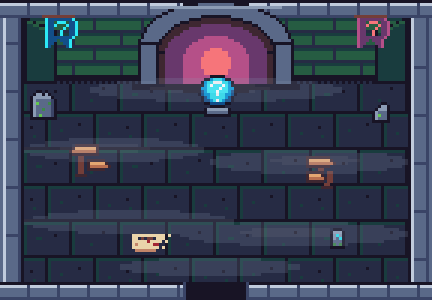
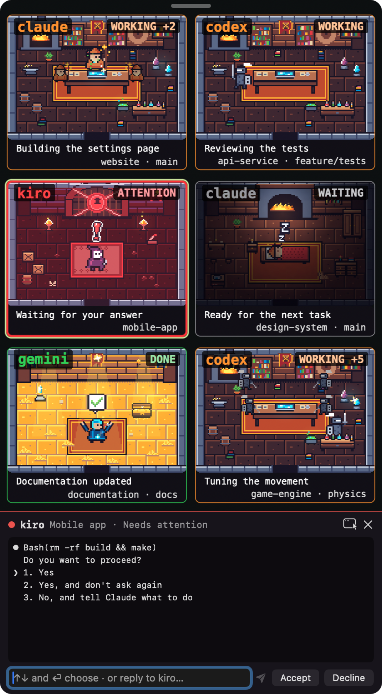

# Herdr Pixel Dungeon

**A native macOS pixel-art guild for your live Herdr agents.**

Built in **Swift, SwiftUI, AppKit and SpriteKit**. Each agent is an animated hero in a dungeon room that changes with its real Herdr status. Lives in a desktop window and your menu bar. No browser, WebView, Node.js, account or server required.

Created by **Nacho Valencia**. All pixel art is original, drawn in Aseprite for this project. Inspired by **[Claude Dungeon](https://github.com/thousandsky2024/claude-pixel-agent-web)** by [thousandsky2024](https://github.com/thousandsky2024).

<p align="center">
  
</p>

<p align="center"><a href="docs/media/demo.mp4">Watch the full demo video</a> · <a href="docs/media/widget.png">Full-size screenshot</a></p>

## Build and open

Requires macOS 13+, Xcode Command Line Tools (`xcode-select --install`) and [Herdr](https://herdr.dev) with `herdr api snapshot` support. Tested with Herdr 0.9.1.

```sh
git clone https://github.com/JoseValencia125/herdr-pixel-dungeon.git
cd herdr-pixel-dungeon
./scripts/build.sh
open 'build/Herdr Pixel Dungeon.app'
```

Optional installation:

```sh
mkdir -p ~/Applications
ditto 'build/Herdr Pixel Dungeon.app' "$HOME/Applications/Herdr Pixel Dungeon.app"
open "$HOME/Applications/Herdr Pixel Dungeon.app"
```

Uses only Apple frameworks; no third-party packages. The build produces a locally ad-hoc-signed app for your Mac's architecture. It is not Developer ID signed or notarized.

Close the window to keep monitoring from the menu bar, where a pixel knight's helm marks the app. Use its menu to reopen the window, set sounds or quit. Enable **Demo** to try fictional agents without Herdr. Live mode never inserts fictional agents.

## States and rooms

| Herdr state | | Room | Hero |
| --- | --- | --- | --- |
| `working` |  | Forge: lit furnace, anvil and sparks | Attacking |
| `blocked` |  | Sealed door: chains, keyhole seal, empty pedestal | Jumps on the rug under a red "!" |
| `idle` |  | Inn room: bed, fireplace, moonlit window, sleeping cat | Waiting |
| `done` |  | Treasure chamber: golden light, gem, open chest | Completion marker |
| unknown |  | Foggy crossroads: three doors, broken signpost | Unknown |

All five rooms are one shared dungeon room that changes with the state. The source is `art/dungeon_rooms.aseprite`, with one tagged frame per state.

<p align="center"></p>

Each harness has its own classic hero, coloured after the tool's brand (no logos are reproduced): **claude** is a coral wizard, **codex** a monochrome knight, **kiro** a purple-hooded rogue with a ghost face, **gemini** a blue star cleric, and any other harness a green adventurer. Source: `art/heroes.aseprite`.

**What a working agent does.** For Claude Code agents the hero goes to the station that matches the last tool the agent called: it reads a book for `Read`, `Grep`, `Glob`, `WebSearch` and `WebFetch`, forges at the anvil for `Edit` and `Write`, brews potions for `Bash`, summons in a magic circle for `Task` (subagents), studies a scroll for todo lists and plans, and types at the laptop while thinking or writing. Other harnesses make the rounds of every station.

**Background sessions.** When a Claude Code pane shows its list of background sessions, Herdr reports the pane as idle, or reflects only the highlighted session, even while other sessions keep working. The app also reads each job's `~/.claude/jobs/<id>/state.json` (state and folder only) and gives a Claude Code pane the most urgent state among the sessions started in its folder during the last hour: one waiting for input makes the room *blocked*, one working makes it *working*.

<p align="center"></p>

**Chat and sounds.** Click a room to open a chat panel for that agent: it shows the last lines of its terminal, sends a message (or the answer to a question it is asking), and has buttons to accept or decline a permission prompt, interrupt the agent, or focus its pane in Herdr. While the agent is asking something with numbered options, ↑ and ↓ (or a click) highlight an option in the panel and put its text in the box; ⏎ then picks it, moving the agent's own menu to that option, or sends the text when the question is plain text. With nothing typed, ⏎ picks the option its terminal already highlights. Right-click a room and choose **End agent** to type `/exit` into its chat after a confirmation (Return cancels; ending needs a click). A working or asking agent gets esc first. A short chiptune plays when an agent needs help and another when it finishes. Turn either off, or mute everything, from the widget or the menu bar.

**Activity log.** The scroll button (top-right on hover, and in the bar under the rooms) unrolls the guild's log on a parchment: agents joining and leaving, state changes (needing attention, finishing…), subagents starting and the messages you sent, newest first with the time. It keeps the last 40 lines in memory only.

**Notifications.** When an agent starts needing help the app also posts a macOS notification (with the question, when it knows it); a finished agent can notify too. Click a banner to bring up the dungeon with that agent's chat open. Turn them on or off per moment from the menu bar's **Notifications** menu; macOS asks for permission the first time.

**Many agents.** Rooms fill two columns (one room when there is a single agent) and the widget grows with them up to the screen's height; past that, scroll with the trackpad or wheel and a thin bar shows where you are. Opening an agent's chat scrolls its room into view. With three or more agents a bar under the rooms shows one chip per state with its count — click one to show only those rooms (the red **!** chip stays lit while anyone needs you) — and a search box that matches project, harness, branch, folder and activity, ignoring case and accents. The chosen chip is remembered.

**Subagents.** Herdr does not report subagents, so for Claude Code agents the app reads the transcripts Claude Code writes under `~/.claude/projects/<project>/<session>/subagents/`. It matches them by the session ID in Herdr's snapshot. A subagent counts as active while its transcript changed in the last 30 seconds. Active subagents appear as a small party of heroes under the agent, with a count. Other harnesses show no subagents.

- Background Herdr queries every second, no overlapping reads, four-second timeout.
- Native SpriteKit animations and crisp nearest-neighbor sprites: the hero types, hammers, jumps on the rug when it needs you, celebrates or sleeps depending on the room.
- Search, state filters, agent selection, project, pane, directory and terminal title.
- Latest status change, counts and menu-bar attention indicator.
- Explicit stale-data indication and automatic reconnection.
- Animation pause and macOS Reduce Motion support.
- Artist credits and licenses accessible from the app.

Activity means **the title reported by the terminal**, not an inferred summary. Animation represents state, not tool calls or completion percentage. Agents outside the selected Herdr session are not included. Very large rosters may share visual positions; the list remains complete.

## Languages

The interface is available in Spanish, English, French, Italian and Portuguese. It follows the macOS language, including the per-app setting in System Settings › General › Language & Region. Other languages fall back to English. Translations live in `Sources/L10n.swift`.

## Configuration

Monitors the principal local session by default. For a named session/custom executable, launch directly:

```sh
HERDR_SESSION=my-session HERDR_BIN=/absolute/path/to/herdr 'build/Herdr Pixel Dungeon.app/Contents/MacOS/HerdrPixelDungeon'
```

Herdr discovery: `~/.local/bin`, `/opt/homebrew/bin`, `/usr/local/bin`, then inherited `PATH`. GUI launches may have a different PATH from your shell. One session per app instance.

## Privacy

The app polls `herdr api snapshot`. It only acts on a terminal when you use the chat panel: then it reads the agent's recent output (`herdr agent read`) and sends exactly what you typed or clicked (`herdr agent prompt`, `send-keys`, `pane send-text`, `agent focus`). No network listener, telemetry or credential access. It reads the state and folder of Claude Code background jobs from `~/.claude/jobs/*/state.json`, and two things from Claude Code's local transcripts: the modification times of subagent transcripts (see Subagents) and, from the last 128 KB of a working session's transcript, the message type and the name of the last tool called. Tool inputs and outputs are never used. When a background job is asking you something, its chat panel shows that question, read from the end of its last message (from the line that asks it on); this text is only displayed, never stored or sent anywhere. Agent data remains in memory. External links open only when clicked. Public source and demo data contain no live user sessions.

## Verify

```sh
./scripts/build.sh
'build/Herdr Pixel Dungeon.app/Contents/MacOS/HerdrPixelDungeon' --self-test
'build/Herdr Pixel Dungeon.app/Contents/MacOS/HerdrPixelDungeon' --diagnose
open 'build/Herdr Pixel Dungeon.app' --args --demo
```

Self-tests cover snapshot states, invalid/empty replies, monitor transitions, subagents, tool actions, translations, sound alerts and their settings, chat selection, git branches, hero mapping and bundled PNG decoding. `--diagnose` prints live agent data; review it before sharing publicly.

## Credits and licenses

- **Nacho Valencia**: code, room backgrounds (`Resources/Sprites/rooms`) and heroes (`Resources/Sprites/heroes`), sources in `art/`. MIT, see [LICENSE](LICENSE) and [NOTICE.md](NOTICE.md).
- **Inspiration**: [Claude Dungeon](https://github.com/thousandsky2024/claude-pixel-agent-web) by thousandsky2024. No code or art from it is included.
- **Herdr contributors**: [Herdr](https://github.com/herdrdev/herdr) and its local API. Herdr is installed separately.

Independent project; no endorsement or affiliation implied.
